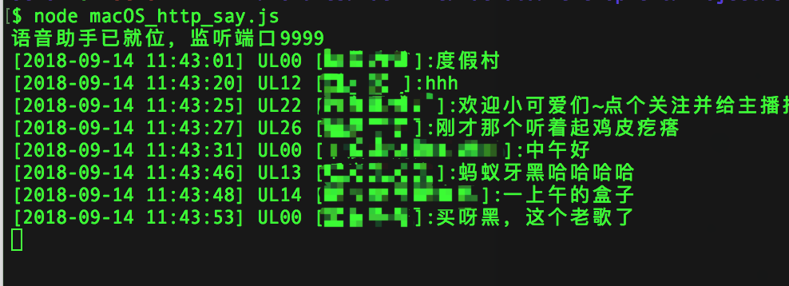

# bilibili_live_chat_reader




# env
-> nodejs  
Install nodejs from https://nodejs.org/en/download/

-> Tampermonkey  
use chrome or other browser
then install https://tampermonkey.net/

# how to use

```node macOS_http_say.js```

click  https://semoz.github.io/bilibili_live_chat_reader/Tampermonkey/writer.js  

to install js  

or new js script and copy content  

open live page  
done!

# -----
# 如何使用  

安装```nodejs```环境，安装浏览器油猴插件  

启动脚本：```node macOS_http_say.js```  

浏览器点击 https://semoz.github.io/bilibili_live_chat_reader/Tampermonkey/writer.js  

安装网页脚本  

完成！
